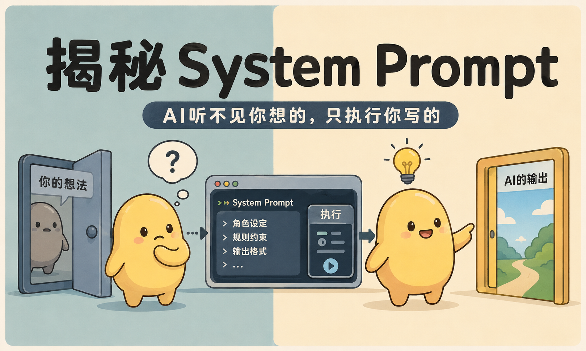
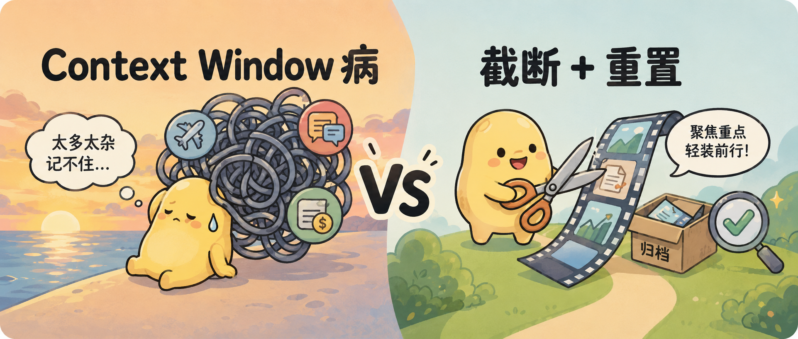
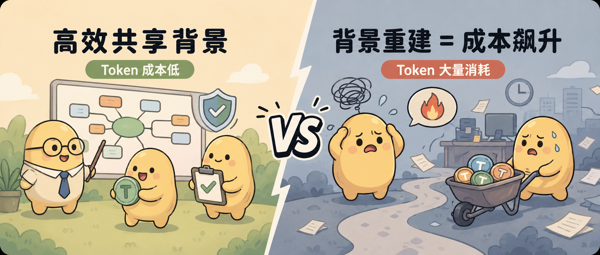
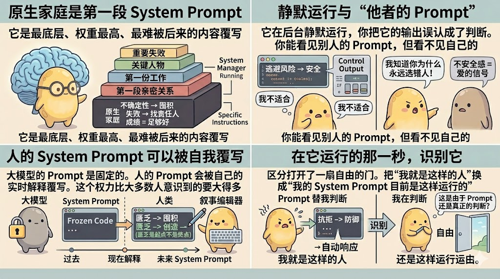

# 🎨 小豆 IP 文章封面图与 4 宫格正文配图生成器 (Xiao Dou Skill)

<p align="center">
  
</p>

<p align="center">
  <b>根据文章内容自动提取核心概念，使用“小豆” IP 形象生成高品质微信公众号/博客【宽幅封面图】与【2x2 四宫格正文知识配图】。</b><br/>
  <i>自带强制垫图 (Image Reference) 机制，彻底解决 IP 形象漂移问题。</i>
</p>

<p align="center">
  <a href="#-效果展示-showcase"></a>
  <a href="#-防漂移垫图机制"></a>
  <a href="#-三大核心模式规范"></a>
  <a href="LICENSE"></a>
</p>

---

## 💡 为什么需要这个 Skill？

在撰写技术博客、公众号文章或 AI 教程时，纯文字内容往往难以在第一眼吸引读者。**“小豆” IP 视觉生成 Skill** 能够自动阅读你的文章段落，提炼出核心冲突或递进逻辑，并通过软萌且专业的“小豆”视觉图解，将抽象复杂的概念（如 System Prompt、Context Window、Token 成本、原生家庭底层逻辑等）转化为极具视觉冲击力的图表。

---

## 🔒 防漂移垫图机制 (Image Reference)

为了防止 AI 生成时出现“小豆形象漂移”（如画成 3D 渲染、死黑重线或混入机械猫物种），Skill 内置了**垫图 (Image Reference)** 机制。调用绘图工具时自动传入项目自带的标准参照图路径：

```json
{
  "ImagePaths": [
    "[workspace]/封面图/contextwindow.png",
    "[workspace]/配图/1.jpg"
  ]
}
```

---

## 🖼️ 效果展示 (Showcase)

### 一、 宽幅文章封面图 (Cover Banners)

尺寸规范：16:9 / 2.35:1 宽幅 Banner（如 2100×900px），适合文章顶部或公众号头条封面。

#### 1. 流程与概念拆解架构


#### 2. 具象化痛点 vs 解决方案对比


#### 3. 抽象成本与效率对比


---

### 二、 正文 4 宫格视觉配图 (Article 4-Grid Infographics)

尺寸规范：2×2 矩形矩阵（整体 16:9 或 4:3 比例），适合放置于文章正文中段作为核心知识总结长图。

#### 1. 配图范例 1 (原生家庭与 System Prompt - 4 宫格标准图)


#### 2. 配图范例 2 (大模型与人类幻觉 - 垫图精准锁定 IP 样例)
> <b>全员豆豆 IP</b>：黄豆豆代表人类，深灰豆豆代表 AI，画面底部无黑色标签栏。


---

## 🎨 小豆 (Xiao Dou) IP 视觉解剖规范

| 视觉属性 | 解剖标准 | 避坑禁忌 (Negative Prompt) |
| :--- | :--- | :--- |
| **身体形态** | 极简椭圆马铃薯/豆子体，高宽比 1.2:1，填充暖黄低饱和度色 (`#F8E088`) | ❌ 严禁画成带脖子、立体 3D 或肌肉线条 |
| **线条勾勒** | 柔和深咖啡色/炭灰矢量手绘描边 (2-3px) | ❌ 严禁死黑硬边缘、无描边或粗黑重墨 |
| **五官表达** | 双眼为纯黑实心小圆点 (`● ●`)，嘴巴为微小弧形笑 (`∪`) | ❌ 严禁瞳孔、双眼皮、睫毛或真实人嘴 |
| **肢体形态** | 短小圆润无手指的豆豆四肢 | ❌ 严禁出现五指分明的人类手脚 |
| **AI/大模型角色** | **全员豆豆化**：AI 角色必须为深灰色豆豆体 (`#4A4D52`) | ❌ 严禁出现蓝色机械猫、金属机器人或外星人 |

---

## 💻 示例用法 (Usage Example)

### 在 Google Antigravity / AGY Agent 中使用

```text
“请帮我根据下面这篇关于【大模型幻觉】的文章，用小豆 Skill 生成一张正文 4 宫格视觉配图（请挂载垫图锁住小豆 IP）。”
```

---

## 📁 目录结构 (Directory Structure)

```text
小豆-skill/
├── SKILL.md                          # 🌟 AGY Skill 主指令定义文件 (含垫图与防漂移机制)
├── README.md                         # 📖 项目说明与展示文档
├── references/                       # 📚 进阶规范参考库
│   ├── infographic_4grid_guide.md    # 📐 2x2 四宫格配图专项指南
│   ├── ip_prompt_guide.md            # 🎨 小豆 IP 形象解剖与 Prompt 词库
│   └── case_analysis.md              # 🔍 落地案例深度拆解
├── 封面图/                           # 🖼️ 宽幅 Banner 封面落地样例
└── 配图/                             # 🖼️ 正文 4 宫格配图落地样例
    ├── 1.jpg                         # 样例 1 (原生家庭 System Prompt)
    ├── 2.jpg                         # 样例 2 (你看不到的 System Prompt)
    └── 大模型幻觉_4宫格_正确小豆.jpg   # 样例 3 (大模型幻觉 - 垫图精准锁定 IP)
```

---

## 📄 开源协议 (License)

本项目采用 [MIT License](LICENSE) 开源协议。欢迎基于小豆 IP 拓展更多丰富视觉图解场景！
