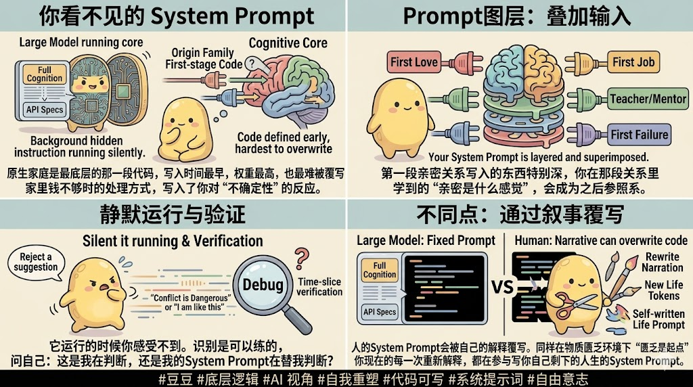

# 🎨 小豆 IP 文章封面图与 4 宫格正文配图生成器 (Xiao Dou Skill)

<p align="center">
  
</p>

<p align="center">
  <b>根据文章内容自动提取核心概念，使用“小豆” IP 形象生成高品质微信公众号/博客【宽幅封面图】与【2x2 四宫格正文知识配图】。</b>
</p>

<p align="center">
  <a href="#-效果展示-showcase"></a>
  <a href="#-安装与使用指南"></a>
  <a href="#-三大核心模式规范"></a>
  <a href="LICENSE"></a>
</p>

---

## 💡 为什么需要这个 Skill？

在撰写技术博客、公众号文章或 AI 教程时，纯文字内容往往难以在第一眼吸引读者。**“小豆” IP 视觉生成 Skill** 能够自动阅读你的文章段落，提炼出核心冲突或递进逻辑，并通过软萌且专业的“小豆”视觉图解，将抽象复杂的概念（如 System Prompt、Context Window、Token 成本、原生家庭底层逻辑等）转化为极具视觉冲击力的图表。

---

## 🖼️ 效果展示 (Showcase)

### 一、 宽幅文章封面图 (Cover Banners)

尺寸规范：16:9 / 2.35:1 宽幅 Banner（如 2100×900px），适合文章顶部或公众号头条封面。

#### 1. 流程与概念拆解架构
> **应用场景**：Prompt 工程、AI 原理、工作流拆解文章。


#### 2. 具象化痛点 vs 解决方案对比
> **应用场景**：长上下文管理、AI 性能优化、技术选型对比。


#### 3. 抽象成本与效率对比
> **应用场景**：Token 成本分析、Prompt 缓存 (Prompt Caching) 机制。


---

### 二、 正文 4 宫格视觉配图 (Article 4-Grid Infographics)

尺寸规范：2×2 矩形矩阵（整体 16:9 或 4:3 比例），适合放置于文章正文中段作为核心知识总结长图。

#### 1. 配图范例 1 (无最下黑条的四宫格标准图)
> **视觉亮点**：四宫格结构清晰，内容呈逻辑递进，最下方纯净无黑色标签栏。


#### 2. 配图范例 2 (正确四宫格布局 - 需去除最下黑条)
> **排版与内容完全正确**：此范例的 4 宫格排版和逻辑插图十分标准，生成时只需**去掉最底部那行黑色 Hashtag 标签栏**（不生成黑条文本）即可达到 100% 理想效果。



---

## 🎨 小豆 (Xiao Dou) IP 视觉设计规范

| 属性 | 视觉设计标准 |
| :--- | :--- |
| **基本形态** | 黄色、圆滚滚、软萌可爱的豆豆形象（Yellow round cute bean character） |
| **表情与姿态** | 极其丰富的戏剧感表现（困惑发愁、戴眼镜授课、手持剪刀裁切、推独轮车、亮起灵感灯泡、推开自由之门等） |
| **画风与配色** | 二维矢量手绘风（Flat storybook vector style），配以淡雅低饱和色调（暖黄、柔绿、灰蓝、紫灰等） |
| **排版与文字** | 中文黑体标题高对比度呈现，支持胶囊型标签、气泡框对话与代码块结合 |

---

## 📐 三大核心模式规范

### 1. 左右对比模式 (Left-Right Contrast)
- **左侧 (痛点/旧态)**：暖灰/冷色背景，困惑或汗流浃背的小豆，搭配重物、线团、混乱元素。
- **中央 (分割)**：高对比度 `VS` 徽章或闪电分割线。
- **右侧 (终局/新态)**：清新绿/阳光背景，自信快乐的小豆，搭配打勾、剪刀、整理箱等元素。

### 2. 流程拆解模式 (Workflow Breakdown)
- **顶栏**：醒目主标题 + 深色椭圆胶囊框金句（如 `AI听不见你想的，只执行你写的`）。
- **流程三段式**：`输入端 (想法/疑问)` ➔ `核心控制 UI (代码框/规则点)` ➔ `输出端 (灯泡小豆/自由门)`。

### 3. 2×2 四宫格正文配图模式 (4-Grid Matrix)
每个宫格自上而下严格遵循 4 层结构：
1. **顶栏**：粗体中文大标题
2. **解说栏**：1-2 句核心释义段落
3. **视觉区**：小豆 IP 配合具体概念图解
4. **底栏**：核心金句总结行

> 💡 **关键细节控制**：生成 4 宫格图片时，保持整洁纯净，不要在画面最下方生成黑色 Hashtag 标签栏。

---

## 💻 示例用法 (Usage Example)

### 在 Google Antigravity / AGY Agent 中使用
只需将本项目置于你的 Workspace 中，或在 Agent 中提及：

```text
“请帮我根据下面这篇关于【AI 智能体记忆机制】的文章，用小豆 Skill 生成一张 16:9 封面 Banner 和一张正文 4 宫格视觉配图。”
```

### 提示词 (Prompt) 模板参考

```text
A 2x2 grid infographic illustration featuring the cute yellow round bean character ("Xiao Dou").
Vector storybook illustration style, soft pastel palette, clear black Chinese text.

Layout: Pure 4-panel grid layout. Do NOT include any bottom black hashtag banner.

Panel 1 (Top-Left): Title "原生家庭是第一段 System Prompt", illustration of Xiao Dou with a brain model and a layered pyramid.
Panel 2 (Top-Right): Title "静默运行与他者的 Prompt", illustration of code editor window and speech bubbles.
Panel 3 (Bottom-Left): Title "人的 Prompt 可以被自我覆写", comparison between frozen code and human narrative editor.
Panel 4 (Bottom-Right): Title "在它运行的那一秒识别它", Xiao Dou recognizing the prompt and opening a door to freedom.
```

---

## 📁 目录结构 (Directory Structure)

```text
小豆-skill/
├── SKILL.md                          # 🌟 AGY Skill 主指令定义文件
├── README.md                         # 📖 项目说明与展示文档
├── references/                       # 📚 进阶规范参考库
│   ├── infographic_4grid_guide.md    # 📐 2x2 四宫格配图专项指南
│   ├── ip_prompt_guide.md            # 🎨 小豆 IP Prompt 词库与 AI 绘图模板
│   └── case_analysis.md              # 🔍 落地案例深度拆解
├── 封面图/                           # 🖼️ 宽幅 Banner 封面落地样例
│   ├── 27D7DB6E-03B0-4739-9F17-054F58190C3E.png
│   ├── contextwindow.png
│   └── token.png
└── 配图/                             # 🖼️ 正文 4 宫格配图落地样例
    ├── 1.jpg                         # 样例 1 (四宫格标准图)
    └── 2.jpg                         # 样例 2 (四宫格标准图，生成时去掉最下黑条即可)
```

---

## 📄 开源协议 (License)

本项目采用 [MIT License](LICENSE) 开源协议。欢迎基于小豆 IP 拓展更多丰富视觉图解场景！
