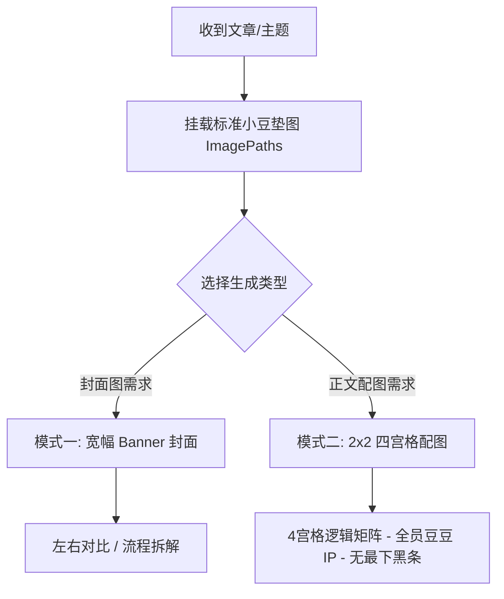

# 小豆 IP 封面图与正文配图生成指南 (Xiao Dou Cover & Illustration Skill)

本 Skill 旨在帮助 Agent 根据用户提供的文章内容、技术概念或主题，自动提炼核心视点，并基于 **“小豆” IP 形象** 自动设计与生成高水准的：
1. **文章封面图 (Cover Banner)**：宽幅 16:9 / 2.35:1 结构。
2. **正文 4 宫格视觉配图 (Article 4-Grid Infographic)**：2×2 逻辑矩阵结构。

---

## 🎨 1. 小豆 (Xiao Dou) IP 形象精准定调与防漂移规范

为防止 AI 图像生成时出现“形象漂移”（如画成 3D 萌物、表情过于复杂、线条死黑或混入机器人物种），**必须严格遵循以下视觉特征与“垫图”机制**：

### 📌 防漂移核心机制：强制挂载标准垫图 (ImagePaths)
在调用 `generate_image` 工具时，**必须**在 `ImagePaths` 数组中挂载以下 1-3 张项目内置的标准示例图作为垫图 (Image Reference)，确保模型锁定小豆的原生画风与角色比例：

- `[workspace]/封面图/contextwindow.png`（标准小豆身材、线条与配色参照）
- `[workspace]/配图/1.jpg`（标准四宫格排版与小豆多场景动作参照）
- `[workspace]/封面图/27D7DB6E-03B0-4739-9F17-054F58190C3E.png`（标准深色 UI 配合参照）

---

### 🔍 小豆 (Xiao Dou) IP 形象精细解剖

```text
       ●   ●      <-- 纯黑实心小圆点眼睛 (间距略宽，无瞳孔/无睫毛)
        \─/       <-- 极简微小弧形笑嘴 (∪)
      /     \     <-- 圆润光滑的暖黄豆豆体 (Potato/Bean Shape)
     (       )    <-- 柔和深咖啡色手绘描边 (Soft dark brown outline, 2-3px)
      \─┬─┬─/     <-- 短小圆润无手指的小手小脚
```

| 视觉元素 | 精细描述与色彩规范 | 避坑禁忌 (Negative Rules) |
| :--- | :--- | :--- |
| **身体轮廓** | 圆润光滑的椭圆马铃薯/豆子体，高宽比约 1.2:1，填充低饱和暖黄色 (`#F8E088` / `#F8DF72`) | ❌ 严禁画成带脖子、带复杂关节或高立体感 3D 渲染 |
| **线条勾线** | 柔和的深咖啡色/炭灰色矢量手绘线条（2-3px 均匀线宽），带微弱手绘温度 | ❌ 严禁死黑硬边缘、粗黑漫画重线或无描边块面 |
| **五官特征** | 双眼为两个纯黑实心小圆点（● ●），嘴巴为微小弧形线（∪），表情呆萌治愈 | ❌ 严禁出现双眼皮、大眼珠、睫毛、真实人嘴或复杂表情 |
| **肢体形态** | 极简短小的小圆手、小圆脚，无手指（手持工具时用软萌手绘比例） | ❌ 严禁画出五指分明的真实人类手脚 |
| **AI/大模型角色** | **全员豆豆化**：AI 角色必须同样为**深灰色豆豆体 (`#4A4D52`)**，体表可附代码框或锁定图标 | ❌ 严禁画成蓝色机械猫、金属机器人、宇宙人或机甲 |

---

## 📐 2. 两大图像生成模式与视觉架构



### 模式一：文章封面图 (Cover Banner)
**尺寸规范**：宽幅横版 Banner（约 16:9 或 2.35:1 比例，如 2100×900px），适合公众号头条封面与文章顶部。

- **架构 A（左右对比）**：
  - 顶部 `主概念 A` **VS** `主概念 B`。
  - 左侧痛点/旧态（灰暗背景，焦虑黄豆豆）；右侧终局/新态（清新绿色背景，自信黄豆豆）。
- **架构 B（流程拆解）**：
  - 顶部 `主标题` + `黑色胶囊金句框`。
  - 左侧输入端 -> 中间控制台 UI -> 右侧输出端。

---

### 模式二：正文 4 宫格视觉配图 (Article 4-Grid Infographic) ⭐ [核心规范]
**尺寸规范**：整体 16:9 或 4:3 比例，2×2 矩形矩阵，淡色实线分隔。

#### 宫格单卡片内部 4 层结构：
1. **顶栏标题 (Grid Title)**：醒目的黑体/粗体中文大标题。
2. **核心释义段 (Subtitle)**：标题下方的解说文字段落。
3. **视觉插图区 (Illustration)**：小豆 IP（黄豆豆/深灰豆豆）配合具体概念图形。
4. **底栏金句行 (Quote Line)**：紧贴该宫格最底部的核心总结文字。

#### 🔴 画面细节约束：
1. **强制挂载垫图**：必须使用 `ImagePaths` 锁定小豆画风。
2. **去除最底部黑条**：严禁生成最底下那行黑色 Hashtag 标签栏（保持纯净 4 宫格）。

---

## 🚀 3. 标准生成工作流

### Step 1: 概念提炼与 Blueprint 规划
解析文章，拆解出 4 个递进子主题，规划标题、释义、小豆姿态与总结句。

### Step 2: 撰写包含“垫图控制”的 Prompt
在 Prompt 中明确引用垫图要求：
`Use the exact character design, line art style, face features, and color palette of Xiao Dou ("小豆") from the reference images.`

### Step 3: 调用 `generate_image`（传入 ImagePaths）
```json
{
  "ImageName": "hallucination_4grid_correct_xiaodou",
  "ImagePaths": [
    "/Users/suxiaohan/Desktop/小豆-skill/封面图/contextwindow.png",
    "/Users/suxiaohan/Desktop/小豆-skill/配图/1.jpg"
  ],
  "Prompt": "...",
  "AspectRatio": "16:9"
}
```

### Step 4: 交付与展示
保存图片并展示给用户。
