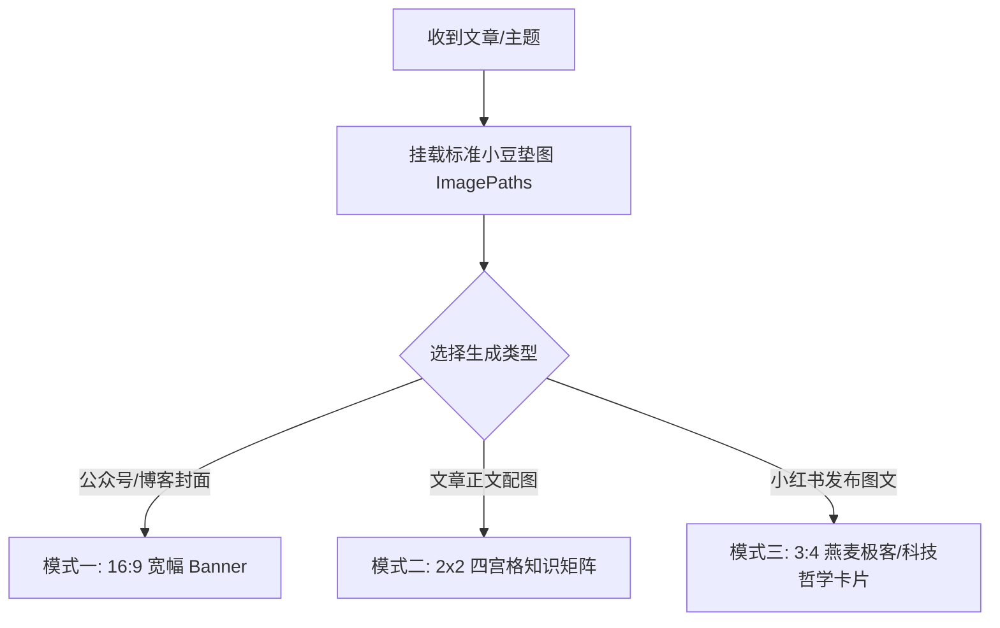

# 小豆 IP 封面图、配图与小红书图文生成指南 (Xiao Dou Visual Skill)

本 Skill 旨在帮助 Agent 根据用户提供的文章内容、技术概念或主题，自动提炼核心视点，并基于 **“小豆” IP 形象** 自动设计与生成高水准的：
1. **公众号/博客封面图 (Cover Banner)**：宽幅 16:9 / 2.35:1 结构。
2. **正文 4 宫格视觉配图 (Article 4-Grid Infographic)**：2×2 逻辑矩阵结构。
3. **小红书高级感 3:4 图文卡片 (Xiaohongshu 3:4 Tech-Philosophy Style)**：燕麦极客/科技哲学高审美风格。

---

## 🎨 1. 小豆 (Xiao Dou) IP 形象精准定调与防漂移规范

在所有插画、封面与配图中，必须严格保持“小豆”IP 形象的一致性：

### 📌 防漂移核心机制：强制挂载标准垫图 (ImagePaths)
在调用 `generate_image` 工具时，**必须**在 `ImagePaths` 数组中挂载 1-3 张项目内置的标准示例图作为垫图 (Image Reference)，确保模型锁定小豆的原生画风与角色比例：

- `[workspace]/封面图/contextwindow.png`（标准小豆身材、线条与配色参照）
- `[workspace]/配图/1.jpg`（标准四宫格排版与小豆多场景动作参照）

---

### 🔍 小豆 (Xiao Dou) IP 形象精细解剖

- **人类/用户/主角（黄豆豆）**：暖黄色椭圆豆子体 (`#F8E088`)，柔和深咖啡色手绘描边 (2-3px 均匀线宽)，纯黑实心小圆点眼睛 (`● ●`)，极简弧形笑嘴 (`∪`)，短小无手指四肢。
- **AI/大模型/系统（深灰豆豆）**：同等画风与描边的深灰色豆豆体 (`#4A4D52`)，体表或头部悬浮代码框或锁定图标。
- **🔴 避坑禁忌**：严禁把 AI 画成蓝色机械猫、金属机器人；严禁死黑硬描边或 3D 渲染！

---

## 📐 2. 三大图像生成模式与视觉架构

### 模式一：文章封面图 (Cover Banner)
**尺寸规范**：宽幅横版 Banner（约 16:9 或 2.35:1 比例），包含【左右对比架构】与【流程拆解架构】。

---

### 模式二：正文 4 宫格视觉配图 (Article 4-Grid Infographic)
**尺寸规范**：整体 16:9 或 4:3 比例，2×2 矩形矩阵。单宫格自上而下包含：`顶栏标题` -> `释义段` -> `黄豆豆/深灰豆豆插画` -> `底栏总结句`。去除最下黑条。

---

### 模式三：小红书 3:4 高级感科技哲学卡片 (Xiaohongshu 3:4 Tech-Philosophy) ⭐ [小红书专属]
**尺寸规范**：小红书最佳长图比例 **3:4 (Vertical Ratio)**。

#### 视觉设计标准：
* **色彩搭配**：深炭灰 (`#1E2022`) 与 暖燕麦色 (`#F5F2EB`) 高质感对比。
* **标题排版**：顶部采用高审美黑体/宋体大标题（如 `你的认知，是代码还是真实？`），下方带有深色椭圆小胶囊框英文标（如 `HUMAN VS AI HALLUCINATION`）。
* **中央视觉区**：深炭灰 UI 窗口显示精细手绘代码/ Prompt 语句（如 `def perception(data): ...`），窗口连接着柔和的发光线条。
* **角色站位**：深灰豆豆 AI 安静坐在左侧，黄豆豆小豆站在右侧探索或握着发光线，体现深度的科技哲学感。
* **🔴 避免土味**：严禁使用老土的红图钉、高饱和红黄色块大贴纸或粗暴的大字报。

---

## 🚀 3. 标准生成工作流

### Step 1: 确定生成类型与概念提炼
确定是生成 **【公众号 16:9 封面】**、**【正文 4 宫格配图】** 还是 **【小红书 3:4 科技哲学卡片】**。

### Step 2: 撰写包含“垫图控制”的 Prompt
明确挂载 `ImagePaths`，并注明高级感科技哲学排版指令（3:4 比例、燕麦色背景、深炭灰 UI 窗口、黄豆豆与深灰豆豆互动）。

### Step 3: 调用 `generate_image`（传入 ImagePaths 与 AspectRatio: "3:4"）

### Step 4: 交付与展示
保存图片并展现给用户。
