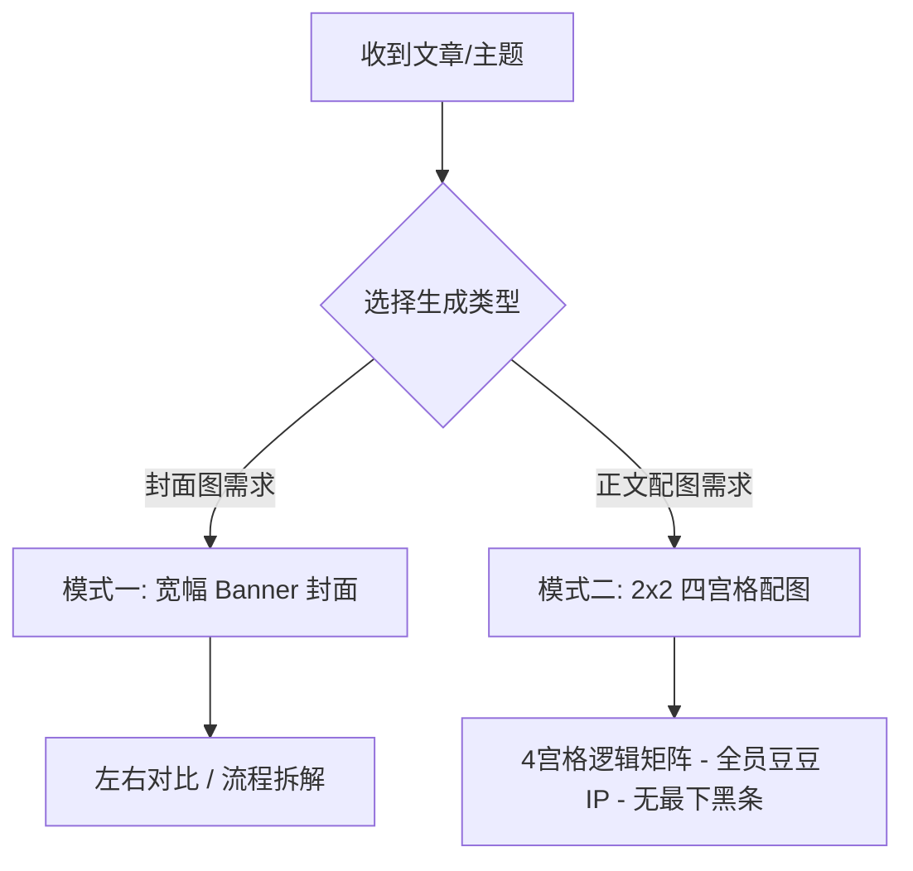

# 小豆 IP 封面图与正文配图生成指南 (Xiao Dou Cover & Illustration Skill)

本 Skill 旨在帮助 Agent 根据用户提供的文章内容、技术概念或主题，自动提炼核心视点，并基于 **“小豆” IP 形象** 自动设计与生成高水准的：
1. **文章封面图 (Cover Banner)**：宽幅 16:9 / 2.35:1 结构。
2. **正文 4 宫格视觉配图 (Article 4-Grid Infographic)**：2×2 逻辑矩阵结构。

---

## 🎨 1. 小豆 (Xiao Dou) IP 视觉规范（严格约束）

在所有插画、封面与配图中，必须严格保持“小豆”IP 形象的一致性：

- **核心物种设定（全员豆豆化）**：
  - **人类/用户/主角**：黄色、圆滚滚、软萌可爱的豆豆形象（Yellow round cute bean character）。
  - **大模型/AI/系统**：**深灰色/暗色豆豆形象（Dark gray cute bean character）**（可在体表悬浮代码块、钥匙锁或数据接头）。
  - 🔴 **绝对禁止物种混杂**：严禁将 AI 画成蓝色的机械猫、金属机器人或外星生物！画面中所有角色均必须统一为豆豆形态。
- **表情与肢体语言**：
  - 极简黑点眼睛（simple black dot eyes），温暖微小的弧形嘴，短小圆润的四肢，无头发。
  - 肢体动作丰富萌动（手持大剪刀、推独轮车、戴眼镜当讲师、画笔修补代码、举着“有动机的推理”盾牌、推开自由之门等）。
- **画风与配色**：
  - **风格**：温和治愈的二维矢量手绘风格（Warm vector hand-drawn illustration / Flat storybook style），线条柔和清晰。
  - **色调**：淡雅高质感背景（暖黄、柔和绿、灰蓝、淡紫等）。

---

## 📐 2. 两大图像生成模式与视觉架构

### 模式一：文章封面图 (Cover Banner)
**尺寸规范**：宽幅横版 Banner（约 16:9 或 2.35:1 比例，如 2100×900px），适合公众号头条封面与文章顶部。

- **架构 A（左右对比）**：
  - 顶部横跨 `主概念 A` **VS** `主概念 B`，配色彩胶囊标签。
  - 左侧痛点/旧态（灰暗背景，焦虑黄豆豆，混乱线团/重物）；右侧终局/新态（清新绿色背景，自信黄豆豆，剪刀/打勾）。
- **架构 B（流程拆解）**：
  - 顶部 `主标题` + `黑色胶囊金句框`。
  - 左侧输入端（想法/疑问） -> 中间控制台 UI（规则/代码块） -> 右侧输出端（灯泡黄豆豆/自由门）。

---

### 模式二：正文 4 宫格视觉配图 (Article 4-Grid Infographic) ⭐ [核心规范]
**尺寸规范**：整体为 16:9 或 4:3 比例，内部等分为 **2×2 的 4 个逻辑宫格卡片**，用淡色实线分隔。

#### 宫格单卡片内部布局规范 (单宫格自上而下)：
1. **顶栏标题 (Grid Title)**：醒目的黑体/粗体中文大标题。
2. **核心释义段 (Subtitle)**：标题下方的解说文字段落。
3. **视觉插图区 (Illustration)**：小豆 IP（黄色豆豆/深灰豆豆）配合具体概念图形（大脑模型、金字塔图层、代码编辑器、对话气泡、时间轴、开关门等）。
4. **底栏金句行 (Quote Line)**：紧贴该宫格最底部的核心总结文字。

#### 4 宫格的逻辑演进顺序：
- **宫格 1 (左上)**：**概念引入/底层定义**
- **宫格 2 (右上)**：**现象揭示/隐性影响**
- **宫格 3 (左下)**：**机制对比/自我覆写**
- **宫格 4 (右下)**：**识别觉察/行动方案**

#### 🔴 画面细节约束：
> [!IMPORTANT]
> 1. **全员豆豆形象**：黄豆豆代表人类/用户，灰豆豆代表 AI，严禁出现机器人。
> 2. **去除最底部黑条**：在生成 4 宫格图片时，**不要生成最底下那行黑色 Hashtag 标签栏**（即不生成如 `#豆豆 #底层逻辑...` 的黑底文字条），保持图片以纯净的 4 宫格主体展现。

---

## 🚀 3. 标准生成工作流

### Step 1: 确定生成类型与概念提炼
- 确定是生成 **【封面 Banner】** 还是 **【正文 4 宫格配图】**。

### Step 2: 撰写视觉 Blueprint 方案
写出 4 个宫格各自的标题、释义段、黄豆豆/灰豆豆动作意象与底部总结句。

### Step 3: Prompt 编写与生成
将 Blueprint 转换为包含全员豆豆 IP 约束与 NO bottom hashtag bar 的 Prompt。

### Step 4: 调用 `generate_image` 生成与交付
保存为清晰的文件名，向用户展示成果与设计逻辑。
