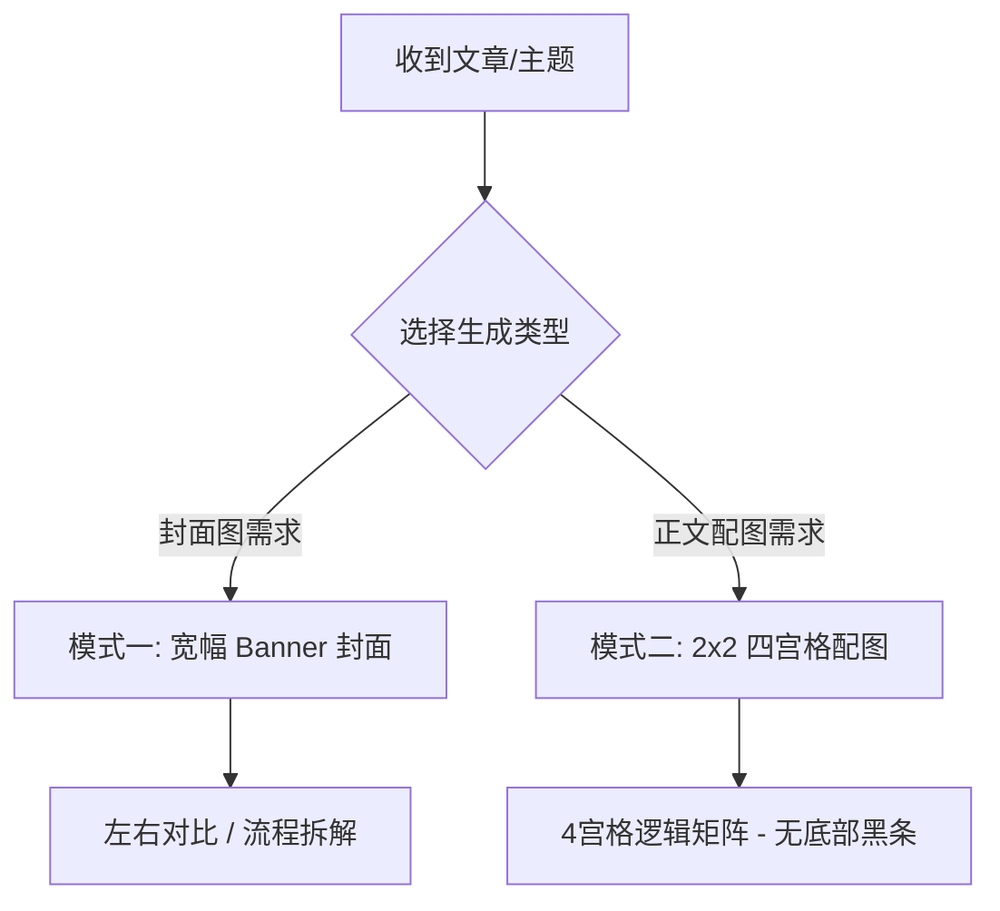

# 小豆 IP 封面图与正文配图生成指南 (Xiao Dou Cover & Illustration Skill)

本 Skill 旨在帮助 Agent 根据用户提供的文章内容、技术概念或主题，自动提炼核心视点，并基于 **“小豆” IP 形象** 自动设计与生成高水准的：
1. **文章封面图 (Cover Banner)**：宽幅 16:9 / 2.35:1 结构。
2. **正文 4 宫格视觉配图 (Article 4-Grid Infographic)**：2×2 逻辑矩阵结构。

---

## 🎨 1. 小豆 (Xiao Dou) IP 视觉规范

在所有插画、封面与配图中，必须严格保持“小豆”IP 形象的一致性：

- **基本形态**：黄色、圆滚滚、软萌可爱的豆豆形象（Yellow round cute bean character）。
- **肢体语言与表情**：
  - 肢体简练萌动，能进行多种动作（如手持大剪刀、推独轮车、戴眼镜当讲师、头顶亮起灯泡、背着沉重线团、画笔修补代码、推开自由之门等）。
  - 表情戏剧感强（困惑发愁、汗流浃背、眼神坚定、充满灵感、思考摸下巴等）。
- **画风与配色**：
  - **风格**：温和治治愈的二维矢量手绘风格（Warm vector hand-drawn illustration / Flat storybook style），线条柔和清晰。
  - **色调**：淡雅高质感背景（暖黄、柔和绿、灰蓝、淡紫等），使用色彩对比强调不同状态。

---

## 📐 2. 两大图像生成模式与视觉架构

根据用户需求或文章体裁，选择合适生成模式：

### 模式一：文章封面图 (Cover Banner)
**尺寸规范**：宽幅横版 Banner（约 16:9 或 2.35:1 比例，如 2100×900px），适合公众号头条封面与文章顶部。

- **架构 A（左右对比）**：
  - 顶部横跨 `主概念 A` **VS** `主概念 B`，配色彩胶囊标签。
  - 左侧痛点/旧态（灰暗背景，焦虑小豆，混乱线团/重物）；右侧终局/新态（清新绿色背景，自信小豆，剪刀/打勾）。
- **架构 B（流程拆解）**：
  - 顶部 `主标题` + `黑色胶囊金句框`。
  - 左侧输入端（想法/困惑） -> 中间控制台 UI（规则/代码块） -> 右侧输出端（灯泡小豆/自由门）。

---

### 模式二：正文 4 宫格视觉配图 (Article 4-Grid Infographic) ⭐ [标准规范]
**尺寸规范**：整体为 16:9 或 4:3 比例，内部等分为 **2×2 的 4 个逻辑宫格卡片**，用淡色实线分隔。

#### 宫格单卡片内部布局规范 (单宫格自上而下)：
1. **顶栏标题 (Grid Title)**：醒目的黑体/粗体中文大标题（如 `原生家庭是第一段 System Prompt`）。
2. **核心释义段 (Subtitle)**：标题下方的解说文字段落（如 `它是最底层、权重最高、最难被后面的内容覆写`）。
3. **视觉插图区 (Illustration)**：小豆 IP 配合具体概念图形（大脑模型、金字塔图层、代码编辑器、对话气泡、时间轴、开关门等）。
4. **底栏金句行 (Quote Line)**：紧贴该宫格最底部的核心总结文字。

#### 4 宫格的逻辑演进顺规：
- **宫格 1 (左上)**：**概念引入/底层定义**（奠定基调与比喻模型）
- **宫格 2 (右上)**：**现象揭示/隐性影响**（后台运行与无意识表现）
- **宫格 3 (左下)**：**机制对比/自我覆写**（大模型 vs 人类叙事重塑）
- **宫格 4 (右下)**：**识别觉察/行动方案**（打破自动化响应，推开自由之门）

#### 🔴 绝对否定约束 (Negative Constraints)：
> [!IMPORTANT]
> **严禁在图片最底部生成黑色 Hashtag 标签栏**（例如绝对不能包含 `#豆豆 #底层逻辑 #AI视角...` 这类黑色底条）。
> * **标准参考**：以 [配图 1.jpg](file:///Users/suxiaohan/Desktop/小豆-skill/配图/1.jpg) 为唯一合格标准；
> * **弃用样式**：严格禁止 [配图 2.jpg](file:///Users/suxiaohan/Desktop/小豆-skill/配图/2.jpg) 底部带有黑色标签栏的形式。

---

## 🚀 3. 标准生成工作流

当收到用户文章或主题时，请按以下步骤执行：

### Step 1: 确定生成类型与概念提炼
- 确定是生成 **【封面 Banner】** 还是 **【正文 4 宫格配图】**（或二者皆生成）。
- 如果是 4 宫格配图，将文章核心逻辑精炼拆解为 4 个连贯递进的子主题。

### Step 2: 撰写视觉 Blueprint 方案
写出 4 个宫格各自的：
1. 标题 (Title)
2. 释义段 (Subtitle)
3. 小豆动作与意象图解 (Visual Elements)
4. 底部总结句 (Quote Line)

### Step 3: Prompt 编写与生成
将 Blueprint 转换为精确 Prompt，包含小豆 IP 规范、2x2 四宫格布局指令、文字与图标排版指令，并强调 **No bottom hashtag black bar**。

### Step 4: 调用 `generate_image` 生成与交付
保存为清晰的文件名（如 `xiaodou_infographic_4grid`），并向用户展示成果与设计逻辑。

---

## 📚 4. 经典案例参考 (Reference Examples)

1. **[配图标准 4 宫格 (1.jpg)](file:///Users/suxiaohan/Desktop/小豆-skill/配图/1.jpg)** — **【标准合格样例】** 纯净 2x2 四宫格，无底部黑条。
2. **[带有底部黑条的错误样例 (2.jpg)](file:///Users/suxiaohan/Desktop/小豆-skill/配图/2.jpg)** — **【禁止样式样例】** 最下方带有 `#豆豆 #底层逻辑...` 黑色黑条，需在生成的 Prompt 中严格避开。
3. **[封面图：揭秘 System Prompt](file:///Users/suxiaohan/Desktop/小豆-skill/封面图/27D7DB6E-03B0-4739-9F17-054F58190C3E.png)** — 封面图流程拆解案例。
4. **[封面图：Context Window 病](file:///Users/suxiaohan/Desktop/小豆-skill/封面图/contextwindow.png)** — 封面图左右对比案例。
